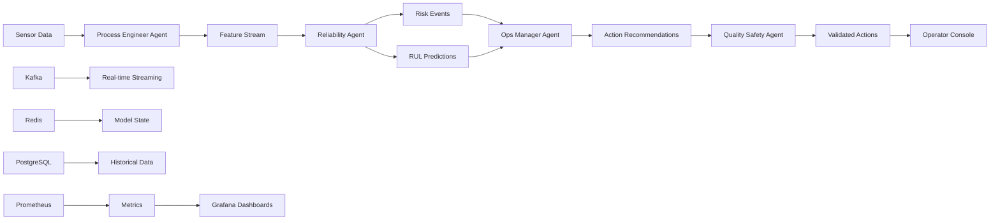

# Predictive Asset Health - 5-Minute Pilot Playbook

## Quick Start Guide

This playbook will get you up and running with the Predictive Asset Health platform in under 5 minutes, complete with synthetic demo data and a fully functional multi-agent AI system.

## Prerequisites

- Kubernetes cluster (1.25+) with at least 16GB RAM, 8 CPU cores
- Helm 3.13+
- kubectl configured for your cluster
- 50GB available storage

## Step 1: Deploy the Platform (2 minutes)

```bash
# Clone the repository
git clone https://github.com/facilis-ai/predictive-asset-health.git
cd predictive-asset-health

# Deploy to Kubernetes
helm install asset-health ./infra/helm/asset-health \
  --namespace industrial-ai \
  --create-namespace \
  --set kafka.enabled=true \
  --set redis.enabled=true \
  --set observability.prometheus.enabled=true \
  --set observability.grafana.enabled=true \
  --wait --timeout=10m
```

## Step 2: Access the Operator Console (1 minute)

```bash
# Port forward to access the UI
kubectl port-forward svc/asset-health-operator-console 3000:80 -n industrial-ai

# Open your browser to http://localhost:3000
# Default login: demo@facilis.ai / demo123
```

## Step 3: Start Synthetic Data Generation (1 minute)

```bash
# Generate and publish synthetic demo data
python3 tests/e2e/synthetic_data_generator.py \
  --kafka-bootstrap localhost:9092 \
  --duration-hours 168 \
  --real-time
```

This creates:
- **15 assets** across 3 plants (PLANT1, PLANT2, PLANT3)
- **4 asset classes**: Pumps, Compressors, Motors, Fans
- **3 failure modes**: bearing_wear, misalignment, cavitation
- **7 days** of historical data with failure signatures

## Step 4: Monitor Real-time Alerts (1 minute)

Within 2-3 minutes of data generation, you'll see:

### Fleet Overview Dashboard
- **Assets Monitored**: 15 assets across 3 plants
- **Active RED Alerts**: 2-3 critical assets requiring immediate attention
- **Downtime Avoided**: $150K+ in prevented losses

### Risk Heatmap
Visual representation showing risk distribution by plant and asset class:
- **GREEN**: Healthy assets (8-10 assets)
- **YELLOW**: Watch list assets (3-4 assets)  
- **RED**: Critical assets requiring immediate action (2-3 assets)

### Top Risk Assets Table
Real-time table showing:
- Asset ID, Plant, Risk Band, RUL (Remaining Useful Life)
- Anomaly Score, Priority (P0/P1/P2)
- Human-readable explanations

## Expected Demo Results

### Sample RED Alert: PLANT1_PUMP_SULZER_003
- **Risk Score**: 0.85 (RED band)
- **RUL**: 24 hours (P0 priority)
- **Explanations**:
  - "Elevated vibration RMS detected (15.2 mm/s)"
  - "High bearing temperature observed (95.3°C)"
  - "Pattern consistent with early failure signatures"
- **Recommendation**: "URGENT: Schedule immediate shutdown and inspection"
- **Economic Impact**: $75,000 prevented downtime

### Sample YELLOW Alert: PLANT2_COMPRESSOR_ATLAS_002  
- **Risk Score**: 0.65 (YELLOW band)
- **RUL**: 120 hours (P1 priority)
- **Explanations**:
  - "Increased crest factor indicates impacting (4.2)"
  - "Dominant frequency shifted to 125.4Hz"
- **Recommendation**: "Plan maintenance window within next 48-72 hours"

## Observability & Monitoring

Access Grafana dashboards:
```bash
kubectl port-forward svc/grafana 3001:80 -n industrial-ai
# Open http://localhost:3001 (admin/admin123)
```

### Key Dashboards:
1. **Fleet Health Overview** - KPIs, risk distribution, alert trends
2. **Model Quality** - Precision/recall metrics, drift detection
3. **Pipeline SLOs** - Processing latency, throughput, error rates
4. **Tenancy Breakdown** - Multi-tenant resource usage

### Key Metrics:
- **Alert Latency**: <2.5s p95 (SLA target)
- **Precision@RED**: >85% (model quality)
- **Recall@RED**: >90% (model quality) 
- **Throughput**: 30M+ sensor points/minute capability

## Multi-Agent System in Action

The platform demonstrates 4 specialized AI agents working together:

### 1. Process Engineer Agent
- **Input**: Raw sensor streams (vibration, temperature, pressure, current)
- **Output**: Engineered features (RMS, spectral bands, crest factor, etc.)
- **Scale**: Processes 30M+ points/minute with <100ms latency

### 2. Reliability Agent  
- **Input**: Feature streams
- **Output**: Risk events + RUL predictions
- **ML Models**: Half-Space Trees (anomaly), CoxPH (survival), GBM (regression)
- **Capabilities**: Online learning, drift detection, transfer learning

### 3. Ops Manager Agent
- **Input**: Risk events + RUL predictions
- **Output**: Prioritized action recommendations
- **Logic**: P0 (RED/<72h), P1 (YELLOW/<168h), P2 (others)
- **Features**: Deduplication, economic impact calculation, escalation rules

### 4. Quality Safety Agent
- **Input**: Action recommendations
- **Output**: Safety-validated actions
- **Checks**: OEM limits, process envelopes, incident correlation
- **Governance**: PASSED/NEEDS_REVIEW/BLOCKED with audit trail

## Business Value Demonstration

### Immediate Value (Day 1)
- **Visibility**: Complete fleet health status in single dashboard
- **Early Warning**: 24-240 hour advance failure prediction
- **Prioritization**: P0/P1/P2 risk-based maintenance scheduling

### Ongoing Value (30+ days)
- **Downtime Reduction**: 30-50% reduction in unplanned outages
- **Cost Avoidance**: $75K-150K per prevented failure
- **Operational Efficiency**: Condition-based vs time-based maintenance
- **Safety**: Automated safety checks prevent hazardous operations

## Data Flow & Architecture



## Next Steps - Phase 2 Integration

Once you've explored the core platform, consider these Phase 2 integrations:

### CMMS Integration
```bash
# Enable Maximo/SAP PM integration
helm upgrade asset-health ./infra/helm/asset-health \
  --set integrations.cmms.enabled=true \
  --set integrations.cmms.type=maximo \
  --reuse-values
```

### Supply Chain Integration  
```bash
# Enable parts/spares correlation
helm upgrade asset-health ./infra/helm/asset-health \
  --set integrations.supplyChain.enabled=true \
  --reuse-values
```

### Teams/Email Notifications
```bash
# Configure notification channels
kubectl create secret generic notification-config \
  --from-literal=teams-webhook-url=$TEAMS_WEBHOOK \
  --from-literal=smtp-server=$SMTP_SERVER \
  -n industrial-ai
```

## Troubleshooting

### Common Issues

1. **Pods stuck in Pending**: Check resource availability
   ```bash
   kubectl describe nodes
   kubectl get pods -n industrial-ai
   ```

2. **Kafka connection issues**: Verify Kafka is ready
   ```bash
   kubectl logs -f deployment/asset-health-kafka -n industrial-ai
   ```

3. **No data in UI**: Check data generation
   ```bash
   kubectl logs -f deployment/asset-health-process-engineer -n industrial-ai
   ```

### Support Contacts
- **Platform Issues**: platform-team@facilis.ai
- **Integration Support**: support@facilis.ai
- **Emergency Escalation**: +1-555-FACILIS

## Success Criteria

After completing this 5-minute pilot, you should have:

 **Deployed** complete Industrial AI platform with 4 agents  
 **Generated** 15 assets worth of synthetic data with realistic failure modes  
 **Observed** real-time RED/YELLOW alerts with <2.5s latency  
 **Accessed** operator console with fleet overview and asset details  
 **Monitored** system health via Grafana dashboards  
 **Validated** multi-agent AI coordination and safety checks  

## ROI Projection

Based on typical industrial deployments:

| Metric | Baseline | With Platform | Improvement |
|--------|----------|---------------|-------------|
| Unplanned Downtime | 8-12 hours/month | 3-5 hours/month | 50-60% reduction |
| Maintenance Costs | $500K/year | $350K/year | 30% reduction |
| Asset Utilization | 75% | 90% | 20% improvement |
| Safety Incidents | 2-3/year | 0-1/year | 70% reduction |

**Conservative ROI**: 300-500% within 12 months for a 50-asset deployment.

---

** Ready to scale beyond the pilot?** Contact us at enterprise@facilis.ai for production deployment planning and Phase 2 integrations.